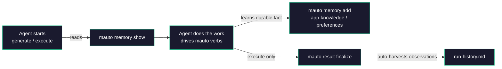

# Cross-Session Memory

mobile-automator keeps a small, durable memory alongside your scenarios and results so the agent gets **smarter about *this* app over time** — instead of re-discovering the same flakiness, selectors, and conventions on every run.

## Why It Exists

Each generate or execute session starts fresh: the agent has the guide content and your `config.json`, but no recollection of what it learned last time. Memory closes that gap. It is a compact, human-readable record of durable knowledge that survives across sessions, so the agent can:

- Avoid re-diagnosing known flaky steps or timing quirks
- Reuse hard-won knowledge about *this* app's screens, flows, and conventions
- Respect standing preferences about how you want tests written and run

The `generate` and `execute` guides now instruct the agent to **consult memory before doing work** and to **record durable knowledge** it learns along the way.

## Where Data Lives

Memory lives in the `mobile-automator/memory/` directory, scaffolded by `mauto setup` alongside `scenarios/`, `screenshots/`, and `results/`. The files are plain, human-readable markdown — project data you can read, review, and (if you want the whole team to share what the agent has learned) commit to version control. The machine-local session state (sockets, pidfiles, the memory lock) lives separately under `mobile-automator/.session/`.

```
mobile-automator/
├── config.json
├── scenarios/
├── screenshots/
├── results/
└── memory/
    ├── run-history.md      # machine-owned (auto-harvested)
    ├── app-knowledge.md    # agent-authored
    └── preferences.md      # agent-authored
```

## The Three Kinds

Memory is split into three **kinds**, each backed by its own file. The key distinction is ownership: one kind is machine-owned and auto-harvested; the other two are agent-authored.

| Kind | File | Owner | How it's written | `add`/`forget` target? |
|---|---|---|---|---|
| `run-history` | `run-history.md` | Machine | Auto-harvested on `result finalize` | No |
| `app-knowledge` | `app-knowledge.md` | Agent | `mauto memory add --kind app-knowledge` | Yes |
| `preferences` | `preferences.md` | Agent | `mauto memory add --kind preferences` | Yes |

### `run-history` — machine-owned

`run-history.md` is written by the CLI, not the agent. When you call `mauto result finalize`, the typed **observations** in the result file — `regression`, `flakiness`, and `state_context` — are folded into a **bounded, rolling per-scenario aggregate**. Old entries age out so the file stays small and useful rather than growing without limit.

Because it is machine-owned, `run-history` is **not a valid target** for `memory add` or `memory forget`. Trying to author it by hand would fight the harvester; let `result finalize` maintain it.

!!! note "Harvesting never fails a finalize"
    Memory harvesting on `result finalize` is best-effort. If a memory write fails, it never fails an otherwise-successful finalize — the problem folds into the envelope's `hint` instead.

### `app-knowledge` — agent-authored

`app-knowledge.md` holds durable facts the agent learns about *your app*: how a particular screen behaves, which flows are fragile, naming conventions, and other observations worth carrying forward. The agent records these with `mauto memory add --kind app-knowledge "<text>"`.

### `preferences` — agent-authored

`preferences.md` captures standing preferences about how you want tests authored and run — style choices, defaults, and conventions the agent should honor going forward. The agent records these with `mauto memory add --kind preferences "<text>"`.

Agent-authored entries (both kinds) are marked `[asserted]`, exact-match de-duped so the same fact is not stored twice, and written under a lock (see [Durability](#durability)).

## The Verbs

Three verbs manage memory. See the [CLI Verbs reference](../reference/cli-verbs.md) for the full surface.

| Verb | Purpose |
|---|---|
| `mauto memory show [--kind <kind>] [--scenario <id>]` | Read memory back (all kinds, or filter by kind / scenario) |
| `mauto memory add <text> --kind <app-knowledge\|preferences>` | Record an agent-authored entry |
| `mauto memory forget --kind <app-knowledge\|preferences> --match <substr>` | Remove agent-authored entries containing a substring |

!!! note "`memory show` prints raw markdown"
    Like `guide`, `schema`, and `bootstrap`, `mauto memory show` prints the **raw markdown** verbatim on success — **not** the uniform JSON envelope. This is deliberate: the agent injects that text straight into its context. `memory add` and `memory forget` return the normal `{ok,data,error,hint,schema_version}` envelope.

`memory add` and `memory forget` accept only `app-knowledge` and `preferences` — the two agent-authored kinds. `run-history` is read-only from the agent's side; you can inspect it with `mauto memory show --kind run-history` but you cannot author or forget it.

## Durability

Memory files are read-modify-written safely so concurrent sessions and interrupted writes never corrupt them:

- **Advisory lock** — every read-modify-write goes through a lock at `mobile-automator/.session/memory.lock`.
- **Atomic writes** — updates are written atomically, so a file is never left half-written.
- **`.corrupt.<ts>` sidecars** — if a memory file is found unreadable, it is preserved as a `.corrupt.<timestamp>` sidecar rather than discarded, so nothing is silently lost.

## How the Agent Uses Memory



The [Generate guide](../guides/generate.md) and [Execute guide](../guides/execute.md) both instruct the agent to consult memory before starting and to record durable app-knowledge or preferences it discovers. On the execute side, `run-history` is maintained for you: each `result finalize` harvests the run's observations into the rolling per-scenario aggregate.

## Next Steps

- [How Skills Work](skills.md) — where memory reads and writes fit into the generate/execute workflows
- [CLI Verbs reference](../reference/cli-verbs.md) — full `memory` verb surface and flags
- [Executor Guide](../guides/execute.md) — how observations become run-history
