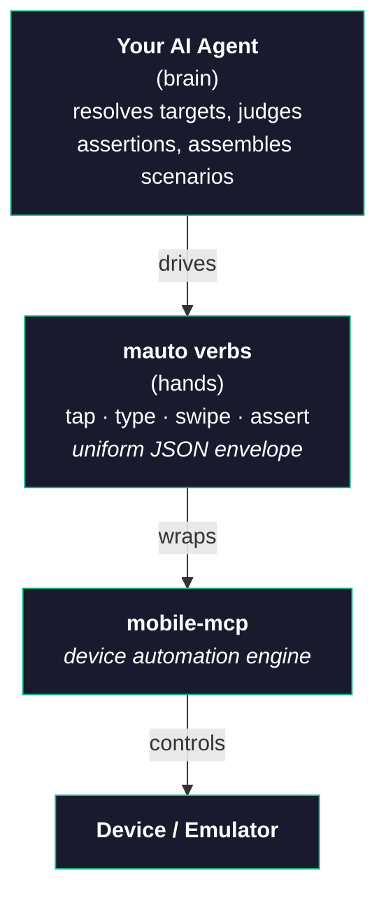

# mobile-automator

Turn **any** AI coding agent into a mobile QA engineer. The host-agnostic `mauto` CLI lets your agent analyze your mobile app, auto-generate test scenarios, and execute them with AI-powered assertions — driving a real device or emulator through [mobile-mcp](https://github.com/mobile-next/mobile-mcp).

## Why mobile-automator?

Testing mobile apps manually is **tedious and error-prone**. Cross-platform testing doubles the pain: iOS, Android, Flutter, React Native, Kotlin Multiplatform—all with different build systems, package managers, and ecosystem conventions.

**mobile-automator** changes this. It's a host-agnostic CLI that any AI agent can drive:

- **Learns your app**: Auto-detects platform, architecture, build system, and business domain
- **Generates tests**: Creates realistic test scenarios from natural language descriptions
- **Executes intelligently**: Runs tests with AI vision that understands your app, not just pixel matching
- **Stays focused**: Works only within your test project—no modifications to your source code

## Key Features

- **Brain / Hands Architecture**: The agent (brain) decides *what* to do; `mauto` (hands) performs deterministic actions via mobile-mcp
- **Any Agent**: Claude Code, Cursor, Gemini CLI, GitHub Copilot, and OpenAI Agents get one-command setup via `mauto init`; any MCP-capable agent connects via `mauto mcp`
- **Platform Detection**: Auto-discovers Android, iOS, Flutter, React Native, Kotlin Multiplatform, and Compose Multiplatform projects
- **Platform-Agnostic by Default**: One scenario runs on Android and iOS, with OS gestures mapped to semantic actions
- **Schema**: 14 action types, 27 assertion types, and advanced retry/condition logic
- **Result Observations**: Captures flakiness, regressions, and state context for smarter debugging
- **Semantic Vision**: AI-powered visual assertions that tolerate cosmetic changes
- **Portable Targets**: Visible text + role + coordinates, never brittle resource-ids

## Quick Start

### 1. Install `mauto` from source

```bash
git clone https://github.com/sh3lan93/mobile-automator
cd mobile-automator
npm install && npm link        # exposes `mauto` globally
```

### 2. Wire it into your project

Navigate to your mobile project and run:

```bash
mauto init --agent claude      # or: cursor | gemini | copilot | agents | all
mauto setup                    # add --mode agnostic for cross-platform apps
```

`init` installs native Agent Skills (and, for Claude Code/Cursor, slash-commands/rules + the `mauto` MCP entry). `setup` scaffolds the `mobile-automator/` workspace and writes its config.

### 3. Check your device

```bash
mauto devices                  # lists devices; mauto devices use <id> to pin one
```

### 4. Generate Tests

From inside your agent, create test scenarios from natural language. In **Claude Code**:

```
/mobile-automator-generate
```

Describe what you want to test. The agent drives the app through `mauto` verbs and writes structured JSON scenarios. In **Cursor**, just ask in plain language; any other agent uses `mauto mcp` or `mauto guide generate`.

### 5. Execute Tests

Run scenarios on the connected device. In **Claude Code**:

```
/mobile-automator-execute
```

Tests execute with AI vision and capture observations (flakiness, regressions, etc.).

### 6. View Results

Check execution results:

```bash
mobile-automator/results/<run_id>.json
```

Results include step details, assertion outcomes, captured variables, and observations for debugging.

## How It Works



**Why this design?** Clear separation:
- **The agent** makes decisions: which target, whether an assertion passed, how to assemble a scenario
- **`mauto` verbs** perform deterministic, scriptable actions and emit `{ok, data, error, hint, schema_version}`
- **mobile-mcp** provides platform-agnostic device automation

Because the contract is just verbs + JSON, **no agent is special** — any agent that can run a shell command or speak MCP can drive the same tool.

## Supported Platforms

- ✅ **Android** (native, Kotlin, Java)
- ✅ **iOS** (native, Swift, Objective-C)
- ✅ **Flutter**
- ✅ **React Native**
- ✅ **Kotlin Multiplatform** (KMP)
- ✅ **Compose Multiplatform** (CMP)

## What's Included

- **One-Command Setup**: `mauto init` ships native Agent Skills for Claude Code, Cursor, Gemini CLI, GitHub Copilot, and OpenAI Agents
- **Platform Modes**: platform-aware (default) and platform-agnostic (`--mode agnostic`) with four semantic actions for cross-platform scenarios
- **Schema**: 14 action types, 27 assertion types, advanced retry/condition logic
- **Result Observations**: Captures flakiness, regressions, and execution context
- **Built-in Schemas**: Scenario and result schemas available via `mauto schema scenario` / `mauto schema result`

## Next Steps

- [Quick Start Guide](getting-started/quick-start.md) — Get up and running in 5 minutes
- [Core Concepts](concepts/architecture.md) — Understand the architecture
- [Setup Guide](guides/setup.md) — Detailed setup workflow documentation
- [Examples](examples/android.md) — Real-world examples for Android and iOS

## Support

- **Documentation**: Full guides and reference at [mobile-automator docs](https://sh3lan93.github.io/mobile-automator/)
- **Issues**: Report bugs at [GitHub Issues](https://github.com/sh3lan93/mobile-automator/issues)
- **Contributing**: See [Contributing Guide](contributing.md)

---

**Ready to automate?** Install `mauto`, then run `mauto init` in your mobile project!
